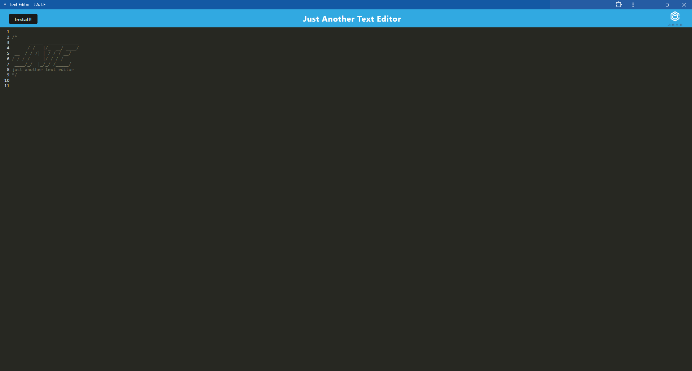

# PWA Text Editor

## Table of Contents

- [Description](#description)
- [Installation](#installation)
- [License](#license)
- [Questions](#questions)
- [Website](#website) 
  
## Description

This functions as a standard text editor. You are able to write anything and it will be saved.

## Installation

The link to the website is listed below. Click the "Install!" button to install the editor as an app for offline functionality.

## License

This project is protected under the MIT License

## Questions

For more questions contact [bewtaich](https://github.com/bewtaich) at <bewtaich@gmail.com>

## Website
URL: https://text-editor-jdq9.onrender.com

